# 🧞 genie

> ### "혼자 보기엔 비싸니까, 믿을 수 있는 사람들과 함께"
>
> 넷플릭스, 디즈니+, 왓챠, 웨이브. OTT 구독료를 함께 나눌 "팟"을 만들고, 신뢰도 기반으로 팟원을 모아 계정과 계좌를 안전하게 공유하는 OTT 팟 구하기 서비스입니다.

- **서비스명**: genie
- **개발 기간**: 2023.04.11 ~ 2023.06.23
- **개발 인원**: 4명 (Backend / Frontend)
- **분반**: 소프트웨어 시스템 개발 01분반

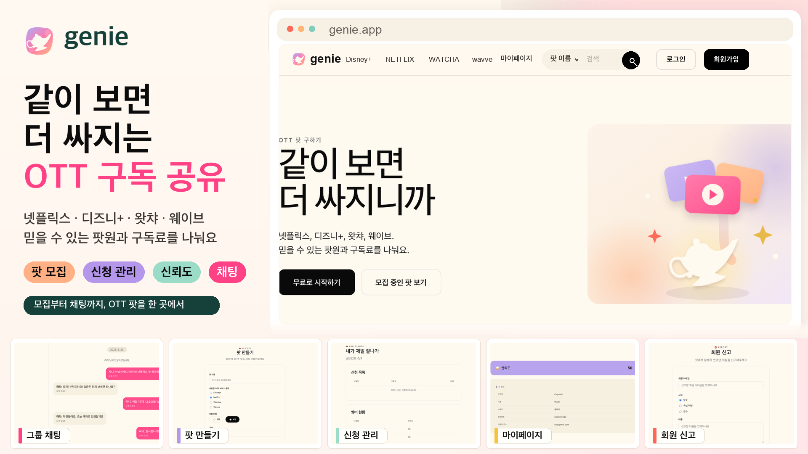

# 목차

- [기획 배경](#기획-배경)
- [주요 화면 및 기능 소개](#주요-화면-및-기능-소개)
- [프로젝트 핵심 기술](#프로젝트-핵심-기술)
- [시스템 아키텍처](#시스템-아키텍처)
- [ERD](#erd)
- [디렉토리 구조](#디렉토리-구조)
- [실행 방법](#실행-방법)
- [팀원 소개](#팀원-소개)
- [기술 스택](#기술-스택)

# 기획 배경

OTT 구독료가 매년 오르면서 한 사람이 여러 서비스를 모두 결제하기엔 부담이 큽니다. 그래서 많은 사람들이 계정을 함께 쓰며 구독료를 나누지만, 정작 **믿을 수 있는 동행을 찾는 일**이 가장 어렵습니다.

- **신뢰의 부재**: 비공식 오픈채팅이나 중고 거래로 팟원을 구하다 보면 잠수, 미입금, 탈주 같은 피해가 잦습니다.
- **정보의 분산**: 계정 아이디와 비밀번호, 입금 계좌, 정산 안내가 여기저기 흩어져 관리가 번거롭습니다.
- **소통의 단절**: 팟원끼리 연락할 창구가 없어 문제가 생겨도 대응이 늦습니다.

**genie**는 이 문제를 한곳에서 해결합니다. OTT별로 "팟"을 만들어 모집하고, **신뢰도 점수**로 상대를 가늠하며, 팟장이 계정과 계좌를 등록하면 **승인된 멤버에게만** 안전하게 공유되고, **팟별 그룹 채팅**으로 바로 소통할 수 있습니다.

# 주요 화면 및 기능 소개

## 🏠 메인 / 팟 둘러보기

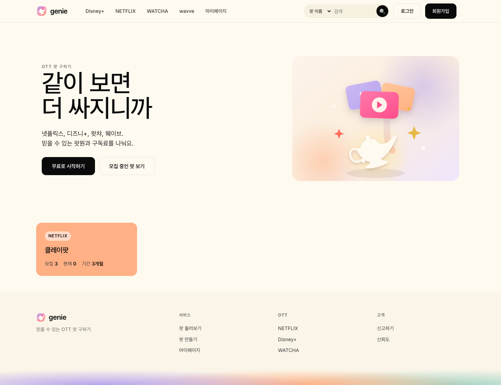

- 메인 화면에서 OTT별 **모집 중인 팟 목록**을 한눈에 보고, 상단 내비에서 넷플릭스/디즈니+/왓챠/웨이브로 필터링할 수 있습니다.
- 팟 이름, 남은 인원, 기간으로 검색할 수 있습니다.
- 마음에 드는 팟은 하트로 찜해두고, 마이페이지의 찜 목록에서 다시 확인합니다.
- 모집 중인 팟이 없을 때는 빈 상태 안내로 팟 생성을 유도합니다.

## 🔐 회원가입 / 로그인

<table>
  <tr>
    <th>로그인</th>
    <th>회원가입</th>
  </tr>
  <tr>
    <td align="center">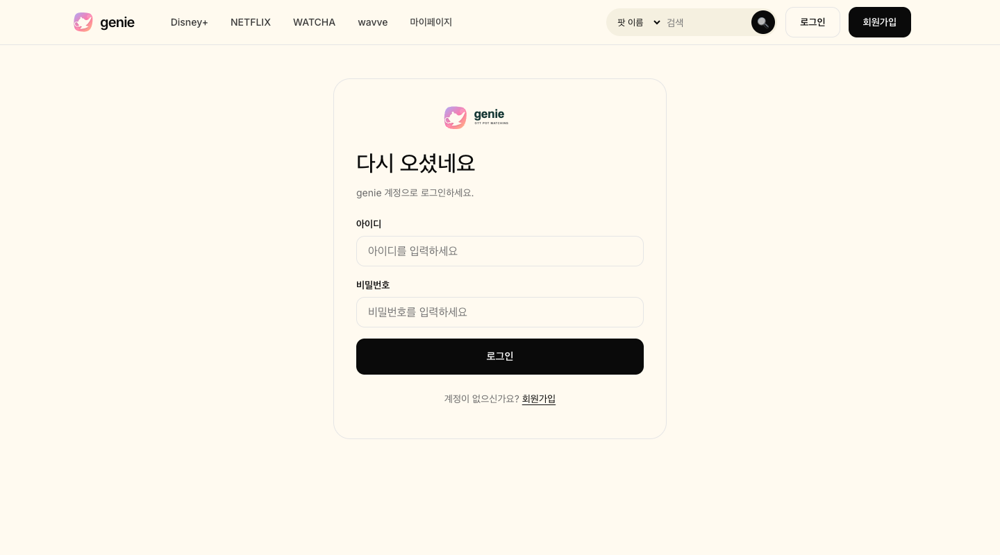</td>
    <td align="center">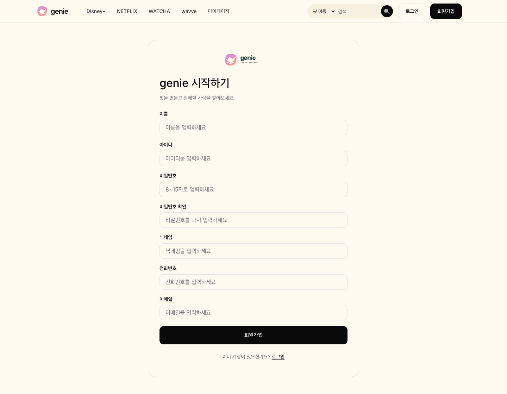</td>
  </tr>
</table>

- 아이디와 비밀번호 기반의 세션 로그인을 제공하며, 비밀번호는 BCrypt로 암호화해 저장합니다.
- 회원가입 시 입력값을 검증하고, 가입과 동시에 초기 신뢰도 점수를 부여합니다.

## 🍿 팟 생성 / 상세 / 시작

<table>
  <tr>
    <th>팟 만들기</th>
    <th>팟 상세</th>
    <th>팟 시작 (계정/계좌 등록)</th>
  </tr>
  <tr>
    <td align="center">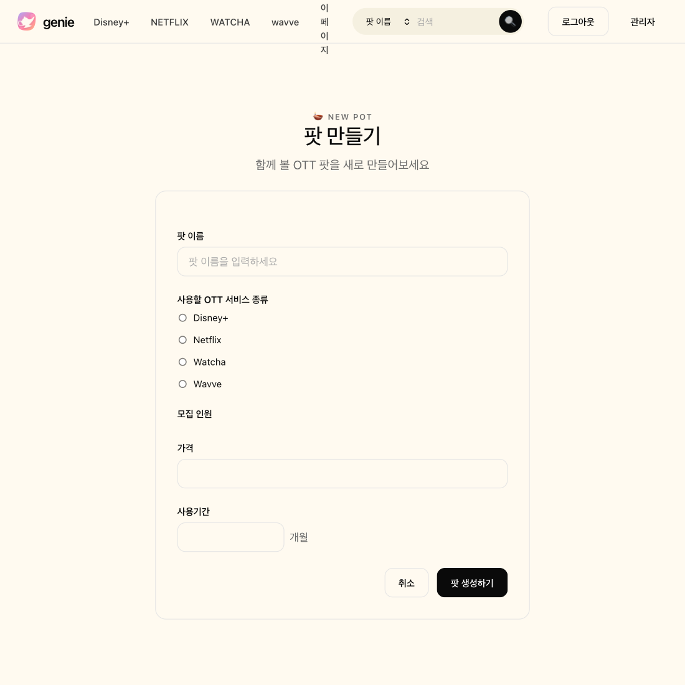</td>
    <td align="center">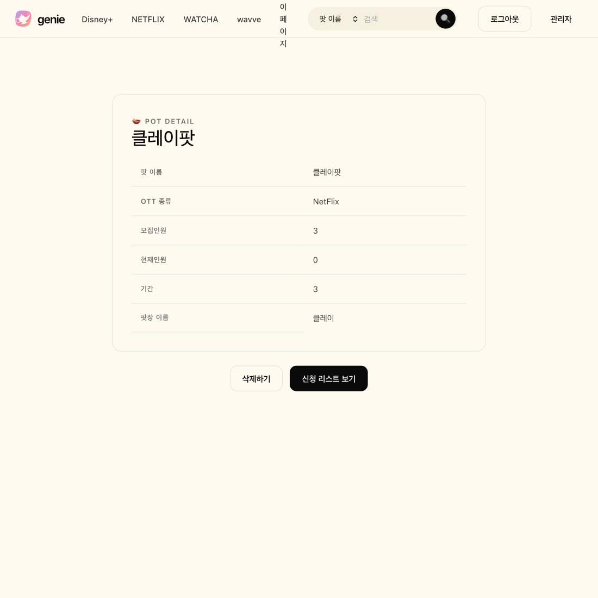</td>
    <td align="center">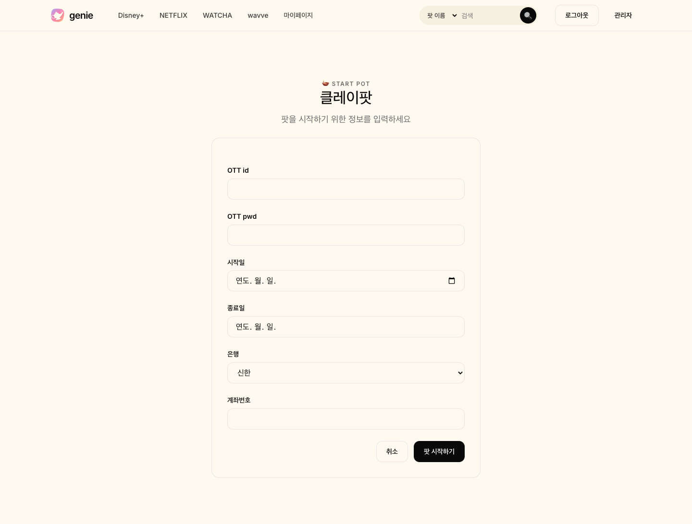</td>
  </tr>
</table>

- **팟 만들기**: OTT 종류, 모집 인원, 사용 기간을 선택해 팟을 개설합니다.
- **팟 상세**: 팟 정보와 모집 현황을 확인하고, 다른 사용자는 가입을 신청합니다.
- **팟 시작**: 정원이 차면 팟장이 OTT 아이디/비밀번호와 은행/계좌번호, 이용 기간을 입력해 팟을 시작합니다. 이 정보는 진행 중 팟의 메인 화면에서 **승인된 멤버에게만** 노출됩니다.

## 👥 신청자 관리 / 그룹 채팅

<table>
  <tr>
    <th>신청자 관리 (팟장)</th>
    <th>팟 그룹 채팅</th>
  </tr>
  <tr>
    <td align="center">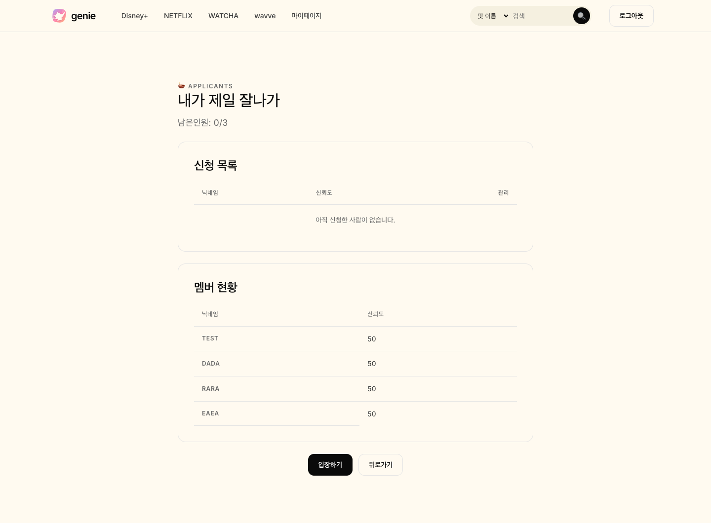</td>
    <td align="center">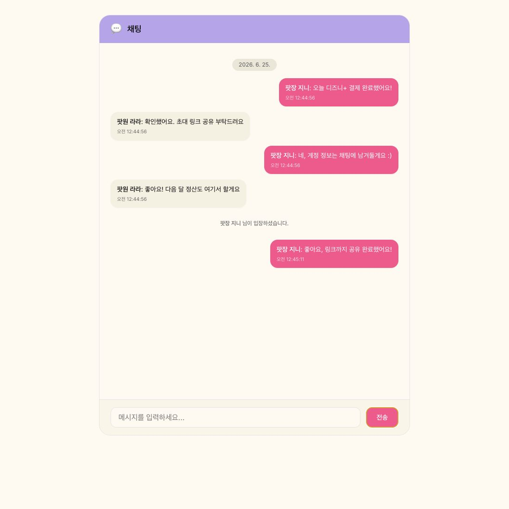</td>
  </tr>
</table>

- **신청자 관리**: 팟장은 신청자의 닉네임과 신뢰도를 보고 승인 또는 거절하며, 현재 멤버 현황을 확인합니다.
- **그룹 채팅**: 시작된 팟의 멤버끼리 실시간으로 대화합니다. WebSocket으로 **팟별로 채팅방이 분리**되어 다른 팟의 대화가 섞이지 않습니다.

## 🙋 마이페이지 / 회원 신고

<table>
  <tr>
    <th>마이페이지</th>
    <th>회원 신고</th>
  </tr>
  <tr>
    <td align="center">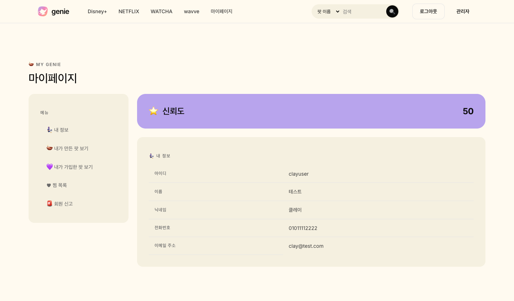</td>
    <td align="center">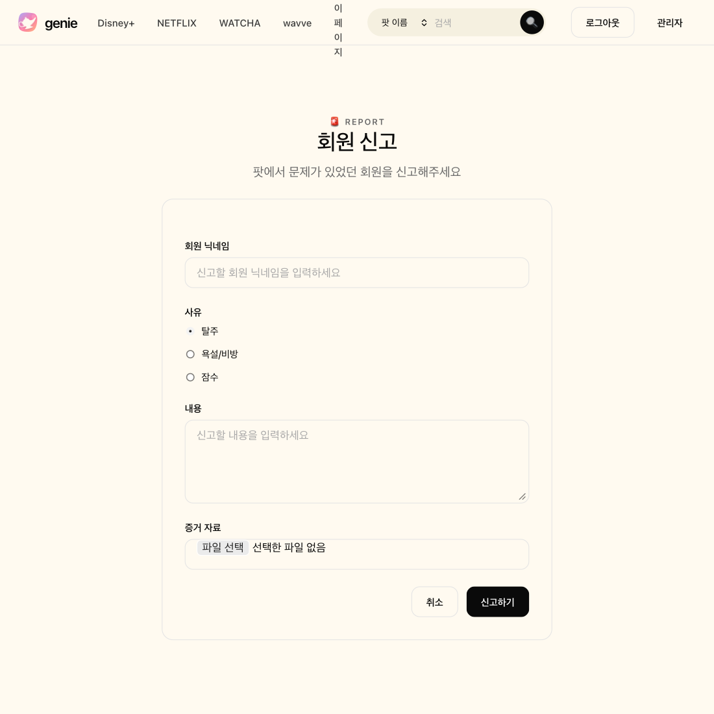</td>
  </tr>
</table>

- **마이페이지**: 내 신뢰도 점수와 기본 정보를 확인하고, 내가 만든 팟 / 가입한 팟 / 찜 목록으로 이동합니다.
- **회원 신고**: 탈주, 욕설, 잠수 등 문제가 된 회원을 사유와 증거 이미지로 신고합니다.

## 🛠️ 관리자

<table>
  <tr>
    <th>회원 관리</th>
    <th>신고 관리</th>
  </tr>
  <tr>
    <td align="center">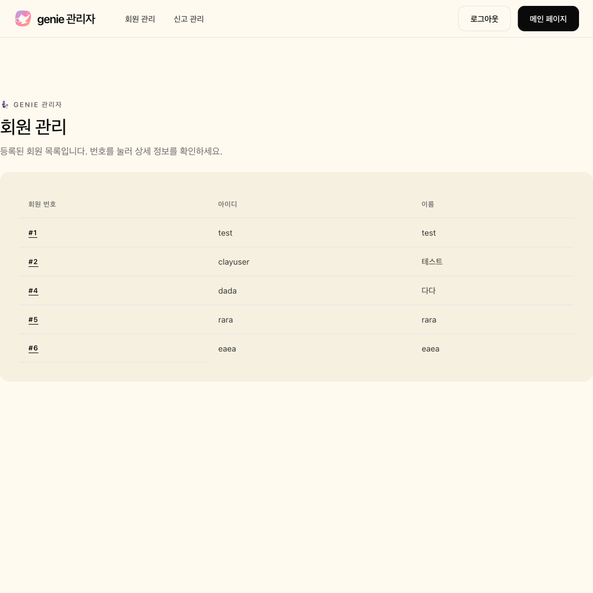</td>
    <td align="center">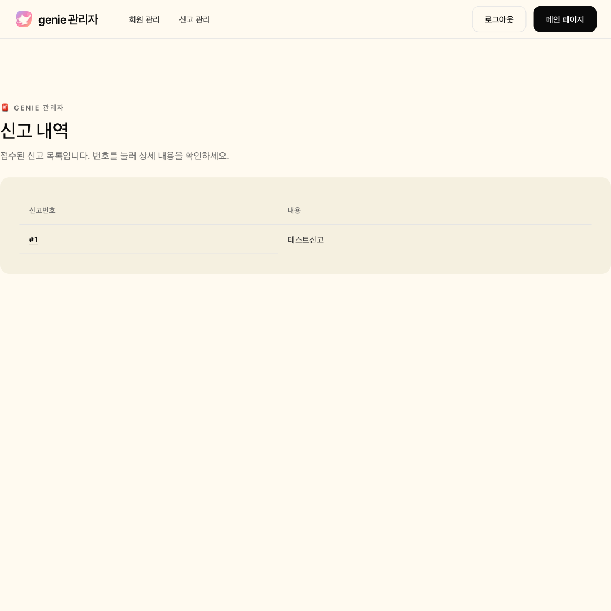</td>
  </tr>
</table>

- 관리자는 전체 회원 목록과 접수된 신고를 확인합니다.
- 신고를 승인하면 신고 유형(탈주/욕설/잠수)에 따라 대상 회원의 신뢰도가 차감되고, 변동 내역이 신뢰도 원장에 기록됩니다.

# 프로젝트 핵심 기술

## 🗨️ 팟별 WebSocket 그룹 채팅

- SockJS 기반 WebSocket으로 실시간 채팅을 구현하고, `potId`별로 세션을 분리해 **팟마다 독립된 채팅방**을 제공합니다.
- 채팅 입장 시 팟장 또는 승인된 멤버인지 **멤버십을 검증**하여 권한 없는 접근을 차단합니다.

## 🔎 QueryDSL 동적 검색

- 팟 이름, 남은 인원, 기간, OTT 종류 등 선택적 조건을 `BooleanBuilder`로 조합해 동적 쿼리를 구성합니다.
- 모집 중(`RECRUITING`) 상태의 팟만 노출하고, 카운트 쿼리를 분리해 정확한 페이징을 제공합니다.

## 🛡️ Spring Security 인증과 권한 분리

- 세션 기반 폼 로그인과 CSRF 보호를 적용하고, URL과 도메인 로직 양쪽에서 권한을 검증합니다.
- **팟장 / 승인 멤버 / 관리자** 권한을 구분하여, 팟 삭제와 시작, 신청 승인은 팟장 본인만, 회원/신고 관리는 관리자만 수행할 수 있습니다.
- OTT 계정과 계좌 정보는 **팟장과 승인된 멤버에게만** 응답 DTO에 담겨 비멤버에게 노출되지 않습니다.

## ⭐ 신뢰도(Reliability) 시스템

- 회원가입 시 기본 점수를 부여하고, 신고가 승인되면 유형별 가중치만큼 점수를 차감합니다.
- 점수 변동은 원장 형태로 기록되어 마이페이지에서 이력을 확인할 수 있습니다.

## 🔒 정원 동시성 제어

- 여러 신청을 동시에 승인할 때 정원이 초과되지 않도록, 팟 조회에 **비관적 락**을 걸어 `remain`(남은 자리) 갱신을 직렬화합니다.

# 시스템 아키텍처

genie는 Spring MVC와 Thymeleaf 기반의 서버사이드 렌더링(SSR) 모놀리식 구조입니다. 하나의 Spring Boot 애플리케이션이 화면 렌더링과 API, 실시간 채팅을 모두 담당합니다.

```text
Browser
  └─ Spring Boot (Embedded Tomcat :8080)
      ├─ Spring MVC + Thymeleaf      # 서버사이드 렌더링 (모든 화면)
      ├─ Spring Security             # 세션/폼 로그인, CSRF, 권한 분리
      ├─ WebSocket (SockJS)          # 팟별 그룹 채팅
      ├─ Spring Data JPA + QueryDSL  # 도메인 영속성, 동적 검색
      └─ MySQL                       # 영구 데이터 저장
```

# ERD

7개 도메인 엔티티로 구성됩니다. 모든 엔티티는 공통으로 `created_date`, `modified_date`(BaseEntity 감사 필드)를 가집니다. `APPLY`와 `INTEREST`는 `(pot_id, user_id)` 복합 유니크 제약으로 중복 신청/찜을 막습니다.

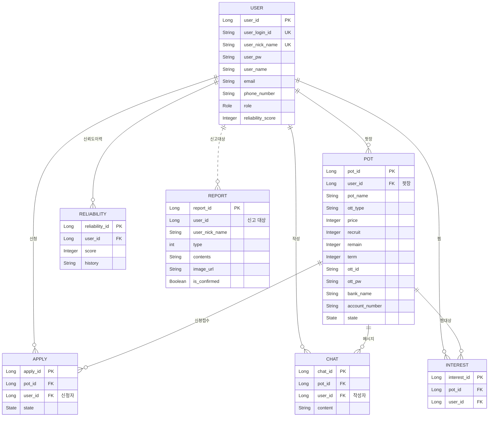
```mermaid
erDiagram
    USER ||--o{ POT : "팟장"
    USER ||--o{ APPLY : "신청"
    POT  ||--o{ APPLY : "신청접수"
    USER ||--o{ CHAT : "작성"
    POT  ||--o{ CHAT : "메시지"
    USER ||--o{ INTEREST : "찜"
    POT  ||--o{ INTEREST : "찜대상"
    USER ||--o{ RELIABILITY : "신뢰도이력"
    USER ||..o{ REPORT : "신고대상"

    USER {
        Long user_id PK
        String user_login_id UK
        String user_nick_name UK
        String user_pw
        String user_name
        String email
        String phone_number
        Role role
        Integer reliability_score
    }
    POT {
        Long pot_id PK
        Long user_id FK "팟장"
        String pot_name
        String ott_type
        Integer price
        Integer recruit
        Integer remain
        Integer term
        String ott_id
        String ott_pw
        String bank_name
        String account_number
        State state
    }
    APPLY {
        Long apply_id PK
        Long pot_id FK
        Long user_id FK "신청자"
        State state
    }
    CHAT {
        Long chat_id PK
        Long pot_id FK
        Long user_id FK "작성자"
        String content
    }
    INTEREST {
        Long interest_id PK
        Long pot_id FK
        Long user_id FK
    }
    RELIABILITY {
        Long reliability_id PK
        Long user_id FK
        Integer score
        String history
    }
    REPORT {
        Long report_id PK
        Long user_id "신고 대상"
        String user_nick_name
        int type
        String contents
        String image_url
        Boolean is_confirmed
    }
```

> `REPORT.user_id`는 JPA 연관관계가 아닌 단순 식별자 참조(soft reference)라서 점선으로 표시했습니다. 나머지 FK는 실제 연관관계입니다.

# 디렉토리 구조

도메인별로 패키지를 나눈 package-by-feature 구조입니다.

```text
genie/
├── src/main/java/com/example/genie/
│   ├── GenieApplication.java    # 애플리케이션 진입점
│   ├── common/                  # 공통 (Security/WebSocket 설정, 예외, 유틸, BaseEntity)
│   └── domain/
│       ├── pot/                 # 팟 생성/검색/시작 (핵심 도메인, QueryDSL 검색)
│       ├── apply/               # 가입 신청 및 승인/거절
│       ├── auth/                # 인증 (회원가입, 로그인, UserDetails)
│       ├── user/                # 회원 정보, 마이페이지
│       ├── chat/                # 팟 그룹 채팅
│       ├── interest/            # 찜
│       ├── reliability/         # 신뢰도 점수와 변동 이력
│       └── report/              # 회원 신고, 증거 파일 업로드
├── src/main/resources/
│   ├── application.yml          # 실행 설정 (datasource, JPA, 포트)
│   ├── templates/               # Thymeleaf 화면 (도메인별 폴더)
│   └── static/
│       ├── css/                 # clay.css (디자인 시스템)
│       ├── js/                  # scripts.js
│       └── image/               # 로고, 히어로 일러스트, OTT 아이콘
├── src/test/java/com/example/genie/   # 단위 테스트 (PotMapperTest, PotTest 등)
├── docs/screenshots/            # 주요 화면 캡쳐
└── build.gradle
```

# 실행 방법

> JDK 17 권장, 로컬 MySQL 필요. 설정 파일(`application.yml`)이 저장소에 포함되어 있어 별도 작성 없이 바로 실행됩니다. (datasource 기준: `localhost:3306`, 사용자 `root`, 비밀번호 없음)

```bash
# 1. 데이터베이스 생성
mysql -u root -e "CREATE DATABASE genie;"

# 2. 실행 (ddl-auto: update 로 테이블 자동 생성)
./gradlew bootRun
# → http://localhost:8080
```

# 팀원 소개

<table>
  <tr>
    <td align="center">
      <br/>
      <a href="https://github.com/sondahyun">손다현</a>
    </td>
    <td align="center">
      <br/>
      <a href="https://github.com/gagle1231">gagle1231</a>
    </td>
    <td align="center">
      <br/>
      <a href="https://github.com/isprogrammingfun">seeun</a>
    </td>
    <td align="center">
      <br/>
      <a href="https://github.com/seungyeonk">seungyeonk</a>
    </td>
  </tr>
</table>

# 기술 스택

## Backend

<div>
  
  
  
  
  
  
  
</div>

## Frontend

<div>
  
  
  
  
  
</div>

## Tools

<div>
  
  
  
</div>

<br/>

**소프트웨어 시스템 개발 01분반 - genie** 🧞
